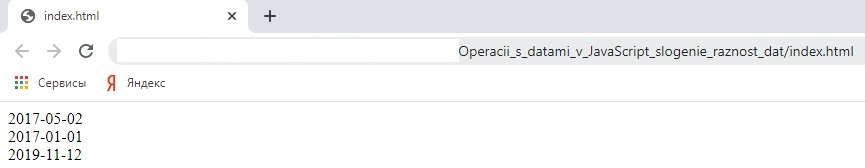

# Операции с датами в JavaScript. Сложение, разность дат.
Ссылка на источник http://blogprogram.ru/operacii-s-datami-v-java-script-slozhenie-raznost-dat/

Одним из сложных моментов в программировании я считаю работу с датами. Особенно если речь идет о изменении дат и операций с ними, например, сложении или разности дат, прибавлении к дате 1 месяца или дня и т.п.

Рассмотрим принцип изменения дат и построим функцию, которая автоматически будет складывать или вычитать нужное нам время.

Скрипт для изменения даты:
```html
<script>
function converttime(onetime, day, month, year){
	// Создаём объект даты из параметра функции onetime:
	var D = new Date(onetime);
	// Изменяем день в месяце в дате:
	D.setDate(D.getDate() + day);
	// Изменяем месяц в дате:
	D.setMonth(D.getMonth() + month);
	// Изменяем год в дате:
	D.setFullYear(D.getFullYear() + year);
	// Формируем день месяца в правильном формате:
	if(D.getDate() < 10){
		var curr_date = "0" + D.getDate();
	} else {
		var curr_date = D.getDate();
	}
	// Формируем месяц в правильном формате:
	if(D.getMonth() < 10){
		// Всегда +1 для месяца, т.к. счёт с 0 по 11
		var curr_month = D.getMonth() + 1;
		curr_month = "0" + curr_month;
	} else {
		var curr_month = D.getMonth() + 1;
	}
	// Сохраняем год в переменной:
	var curr_year = D.getFullYear();
	// Получаем конечную, изменённую дату:
	// (формат даты на выходе можно менять как угодно)
	var newDate = curr_year + "-" + curr_month + "-" + curr_date;
	// Выводим дату в документ:
	document.write(newDate);
	document.write("<br>");
}

// Пример использования функции converttime(onetime, day, month, year):
converttime('2016-05-02 02:07:16', 0, 12, 0);  // +12 месяцев
converttime('2016-12-31 02:07:16', 1, 0, 0);  // +1 день
converttime('2020-03-12 02:07:16', 0, -4, 0);  // -4 месяца
</script>
```
Вывод скрипта:



Можно заменить вывод даты напрямую в документ:
```js
// Выводим дату в документ:
	document.write(newDate);
	document.write("<br>");
```
на вывод даты в тег `<span id = "primer_date"></span>`
```js
// Выводим дату в тег с id = "primer_date":
	document.getElementById('primer_date').innerHTML = newDate;
```
